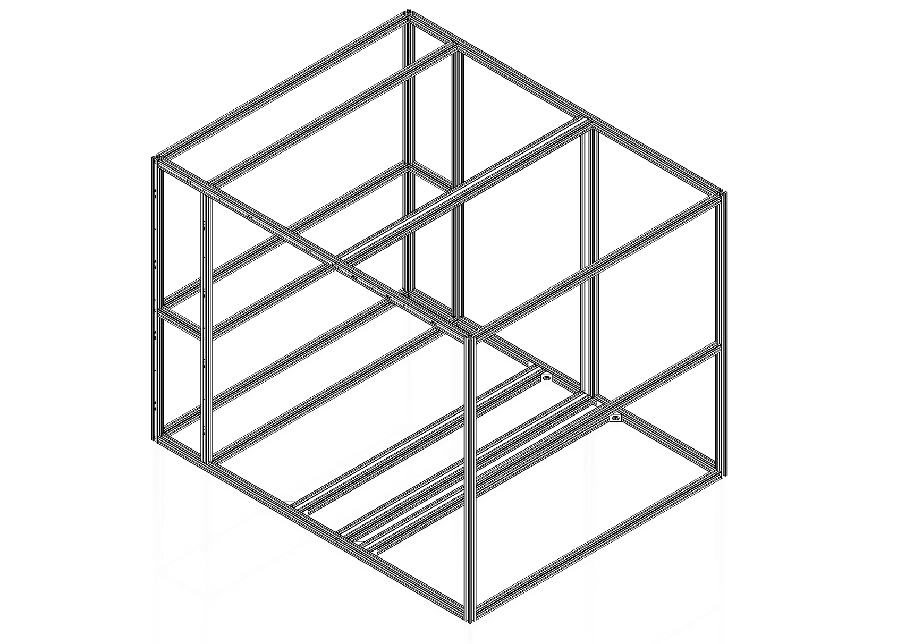
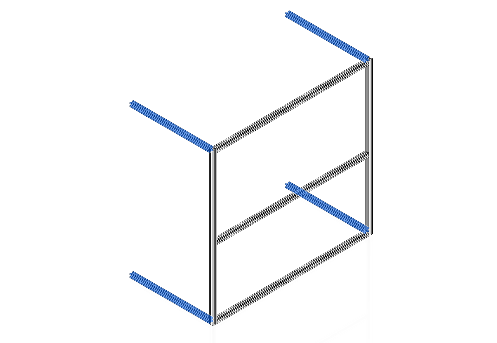
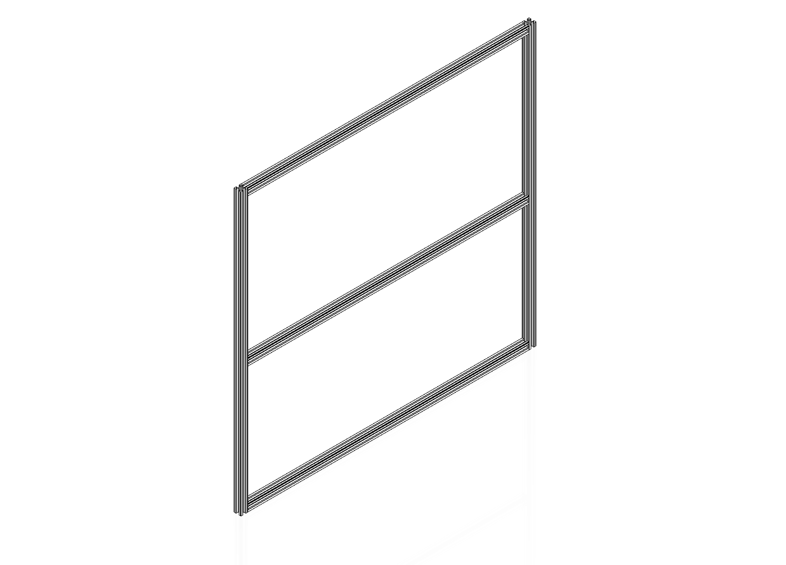
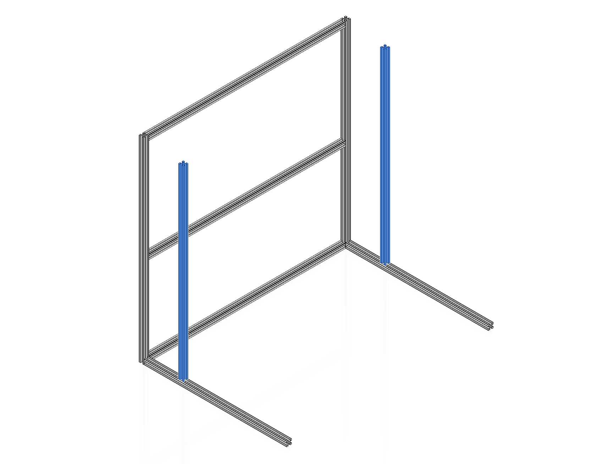
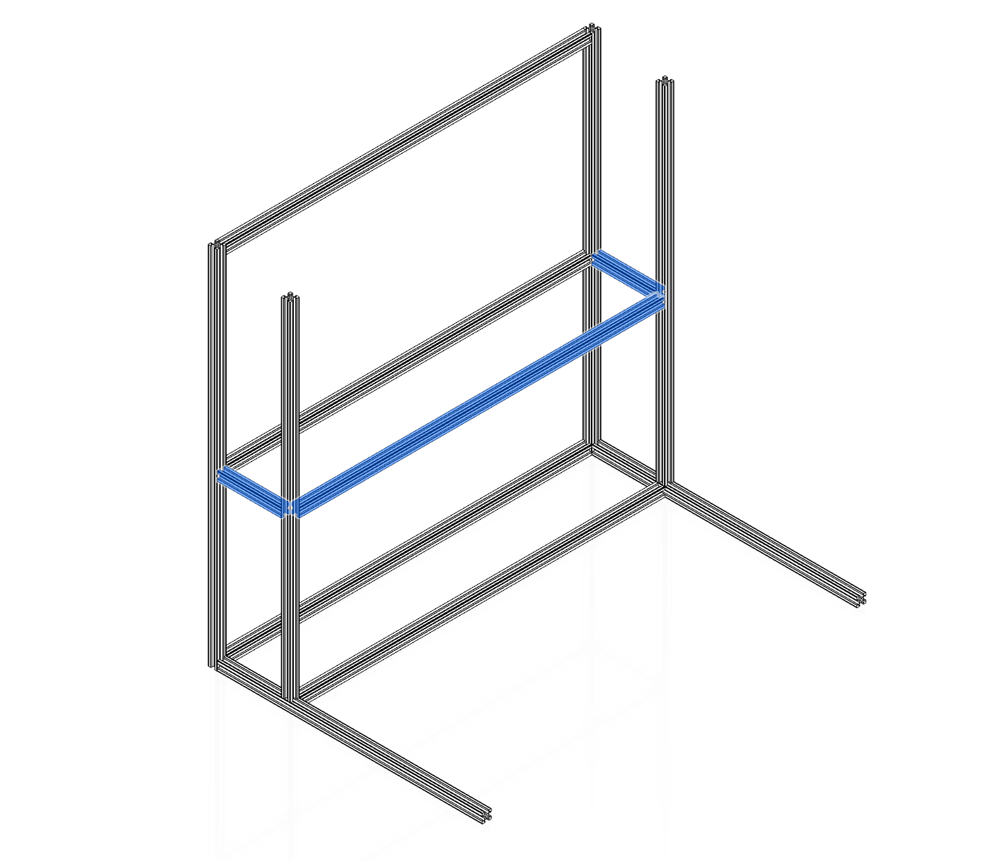
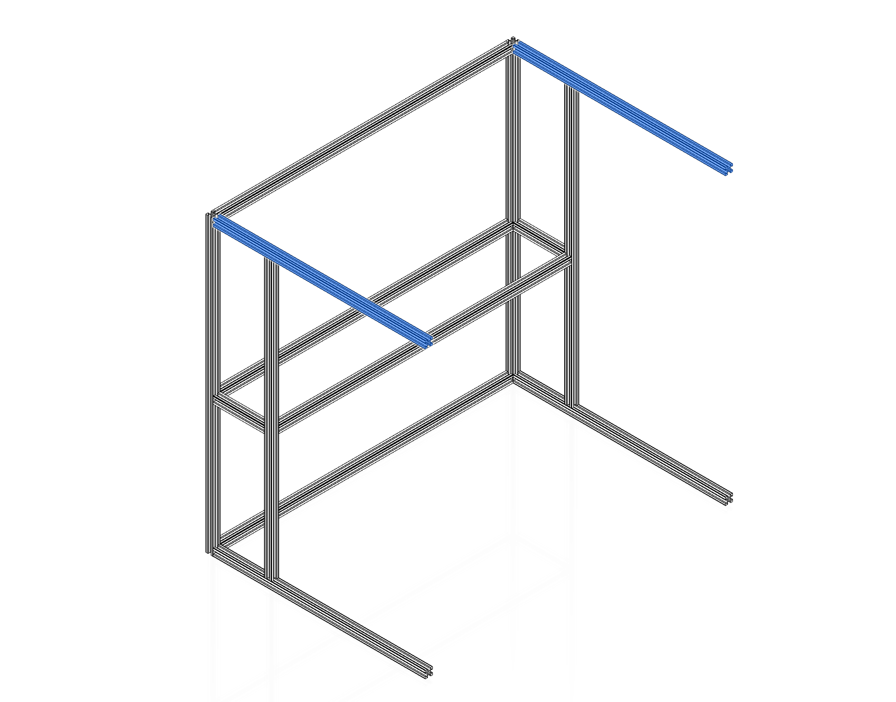

# Outer Frame Assembly



The outer frame assembly of Casa is built from 2020 V slot extrusion in two halves. Each half is joined together by a backbone of 2040 extrusion making the enclosure easy to dissemble for moving. The panels, sliding door, electronics, and basement will attach to this main frame. Throughout this stage remember to check for squareness and adjust accordingly.

The outer frame assembly uses 8 different extrusions labeled A - H. Some extrusions are the same length but features different cross drill patterns so make sure to pay attention and select the correct extrusion. Cross drills are found on extrusions A, C, D, and H only. If you are cross drilling your own extrusion you may find the cross drill guides useful.

<!-- We really need a way of defining the extrusions here -->

!!! tip "Blind Joints"
    

    The frame of Casa is assembled using blind joints. These are simple and cheap joints that provide excellent strength through metal-to-metal contact. Blind joints require cross drilling the extrusion to allow access to tighten down a button head bolt and also require manual alignment. Make sure that joints are aligned and square when tightening.

    **All blind joints are secured using an M5 x 10 BHCS screw.** In the interest of simplifying this manual, we have chosen to omit the button head bolts. Wherever a part interfaces with an extrusion in a way that looks like it requires a bolt for a blind joint, then it should be considered a part that requires a bolt.

---

!!! info annotate "Components Required"
    ```
        1 x Extrusion A
        3 x Extrusion B
        3 x M5 x 10 BHCS
    ```


---

!!! info annotate "Components Required"
    ```
        1 x Extrusion A
        3 x M5 x 10 BHCS
    ```


!!! note "Orientation"
    Note that this part is **not** symmetrical. The central cross beam sits closer to the bottom of the enclosure than to the top.

---

!!! info annotate "Components Required"
    ```
        4 x Extrusion H
        4 x M5 x 10 BHCS
    ```


---

The 2040 extrusions used here form the backbone of Casa. In this step, connect only a single side. The other half of the enclosure will connect to the other side.

!!! info annotate "Components Required"
    ```
        2 x Extrusion E
        1 x Extrusion F
        6 x M5 x 10 BHCS
    ```


---

Repeat step 1 & 2
!!! info annotate "Components Required"
    ```
        2 x Extrusion A
        3 x Extrusion B
        6 x M5 x 10 BHCS
    ```


!!! note "Orientation"
    Note that this part is **not** symmetrical. The central cross beam sits closer to the bottom of the enclosure than to the top.

---

!!! info annotate "Components Required"
    ```
        2 x Extrusion C
        2 x M5 x 10 BHCS
    ```


---

!!! info annotate "Components Required"
    ```
        2 x Extrusion D
        2 x M5 x 10 BHCS
    ```


---

!!! info annotate "Components Required"
    ```
        2 x Extrusion F
        2 x Extrusion B
        6 x M5 x 10 BHCS
    ```


---

!!! info annotate "Components Required"
    ```
        2 x Extrusion C
        2 x M5 x 10 BHCS
    ```


---

!!! info annotate "Components Required"
    ```
        2 x Extrusion B
        4 x M5 x 10 BHCS
    ```


---

Assemble the two halves together
!!! info annotate "Components Required"
    ```
        6 x M5 x 10 BHCS
    ```


---

!!! info annotate "Components Required"
    ```
        2 x Extrusion E
        4 x 2020 Corner Bracket
        4 x M5 x 8 BHCS
    ```


---
Assemble the machine supports to the bottom of the enclosure. Leave the screws loose at this stage to allow repositioning to best fit your machine.
!!! info annotate "Components Required"
    ```
        4 x M5 x 8 BHCS
    ```


---

[Next Chapter: Sliding Door Assembly](./20_sliding_door_assembly.md)
