# Assemble Electronics Area

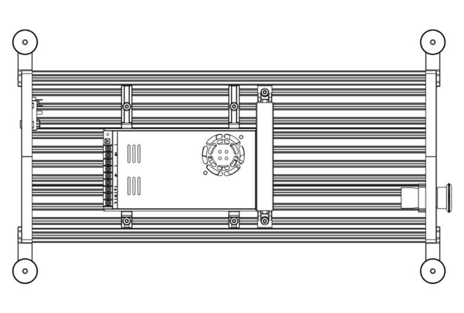{: .shadow}

!!! info annotate "Are you building an LDO kit?"
    LDO has written a fantastic supplementary guide for the wiring included with their kit which includes pre-cut, pre-crimped, and pre-soldered cables! If you're building an LDO kit check out their guide [here!](https://www.ldomotion.com/#/guide/Milo-CNC-V15-Wiring-Guide)

---

## Cable Channel and PSU Installation

!!! info annotate "Components Required"
    ```
    3 x M5x8mm BHCS
    4 x M5x10mm BHCS
    4 x M4x10mm BHCS
    2 x PSU Mounting Bracket A (1)
    2 x PSU Mounting Bracket B (2)
    1 x Cable Channel (3)
    1 x Cable Channel Cover (4)
    ```
1. :material-printer-3d-nozzle-heat-outline: Print this part using the [recommended settings](../../printing/print_guide.md#electronics-table)!
2. :material-printer-3d-nozzle-heat-outline: Print this part using the [recommended settings](../../printing/print_guide.md#electronics-table)!
3. :material-printer-3d-nozzle-heat-outline: Print this part using the [recommended settings](../../printing/print_guide.md#electronics-table)!
4. :material-printer-3d-nozzle-heat-outline: Print this part using the [recommended settings](../../printing/print_guide.md#electronics-table)!

---

Install the printed `Cable Channel` using M5x8mm BHCS.

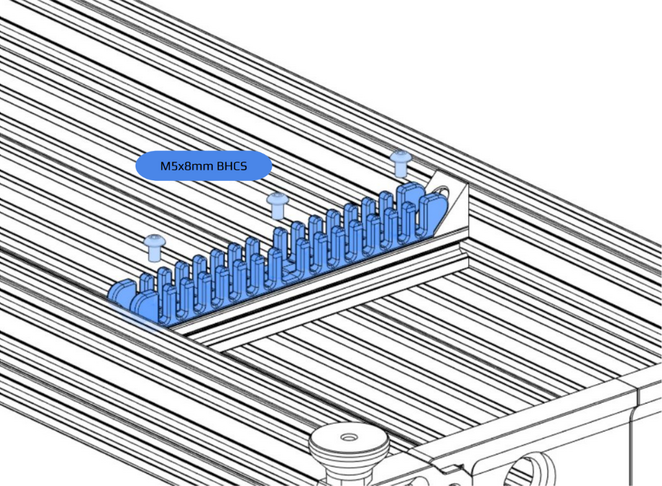{: .shadow}

---

Install 2 x `PSU Mounting Bracket A` on PSU using M4x10mm BHCS.

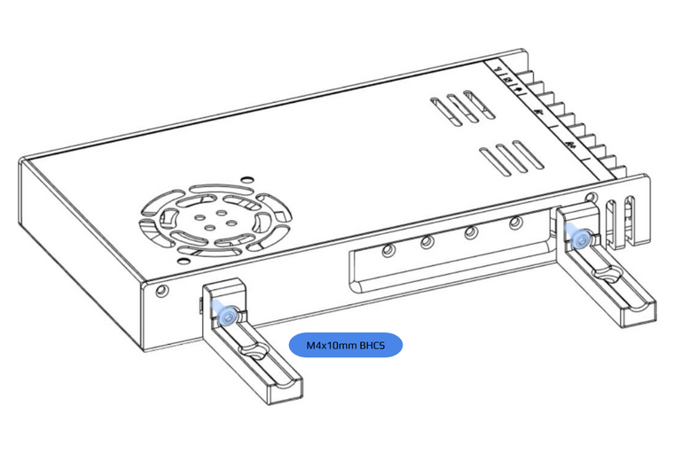{: .shadow}

---

Install 2 x `PSU Mounting Bracket B` on PSU using M4x10mm BHCS.

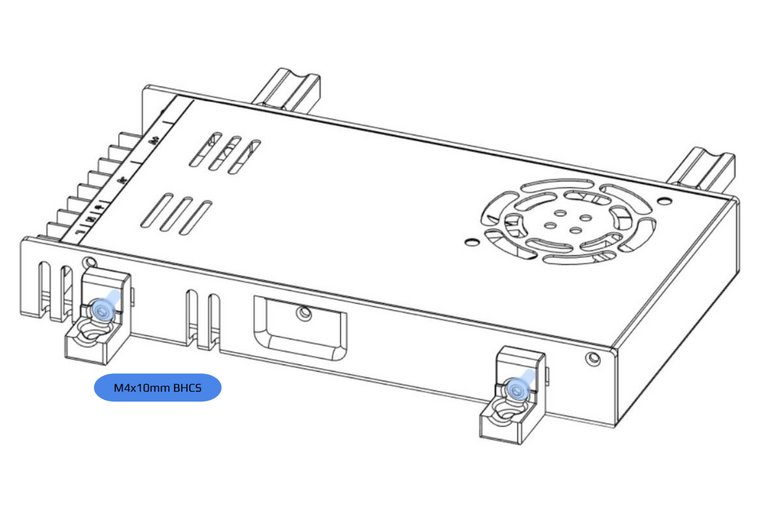{: .shadow}

---

Install PSU into electronics area using M5x10mm BHCS.

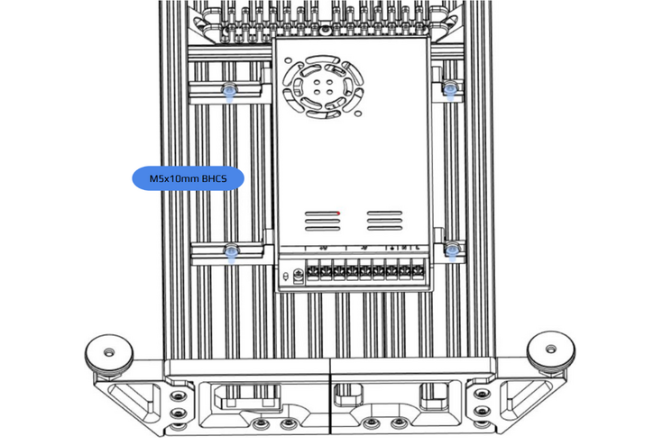{: .shadow}

---

## AC Inlet and Emergency Stop
!!! info annotate "Components Required"
    ```
    1 x M5x8mm BHCS
    1 x IEC320 C14 Inlet - Push-fit
    1 x 22mm Emergency Stop Actuator
    ```

Push-fit the AC inlet into the rear of the electronics table skirt.

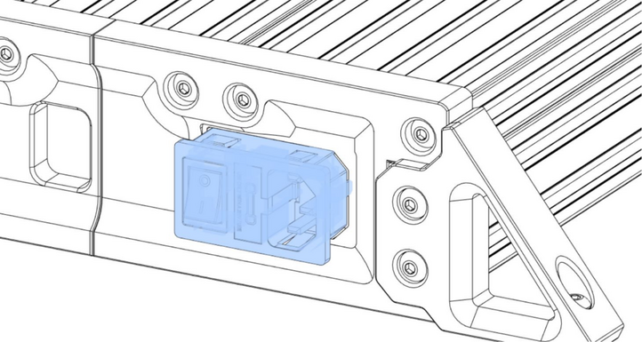{: .shadow}

---

## E-Stop Disassembly

To install your E-stop you must first disassemble it. Most E-stops split in two by spinning the button while keeping the body in place. To reassemble it, perform the aforementioned steps backward.

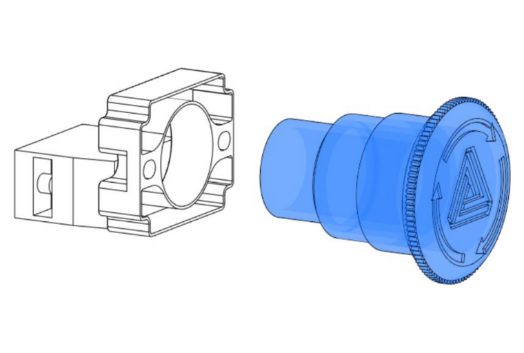{: .shadow}

---

Install the E-Stop into the front of the electronics table skirt. If your E-Stop has a threaded locking collar, tighten it against the back of the skirt.

{: .shadow}

Snap (or bolt) the E-Stop switch plate and switch(es) onto the back of the E-Stop assembly.

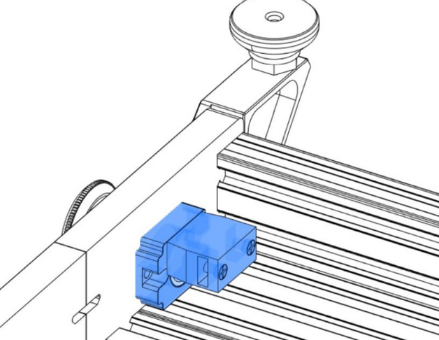{: .shadow}

---
## AC Wiring

!!! warning "Here Be Dragons"
    Hopefully, it does not need to be said, but this is the part of the build process where you must be most thorough. Never take shortcuts, guess, or "wing it"; when it comes to AC wiring.

    Getting any of this wrong, or with connections back to front, will at minimum cost you real money - and maximum, a lot of pain or **actual death**.

    Check, and re-check _everything_ with a multimeter. If you don't have or don't know how to use a multimeter at this point, you owe it to yourself and everyone who loves you to go and buy one and learn how to use it before continuing.

!!! info annotate "Components Required"
    ```
    18AWG Mains Wiring (Neutral, Live, Ground)
    ```

If you plan to use a VFD to power your spindle, you can split the AC input going to the PSU to power your VFD as seen in the diagram below.

!!!note
    Consult local electrical regulations for information on the cable termination, minimum cross-sectional area, suitable fuse, and breaker sizes, and refer to your VFD manual for their recommended installation method which may include input or output reactors or contactors.

Wire the AC Inlet, PSU, E-stop, and VFD according to the diagram below.

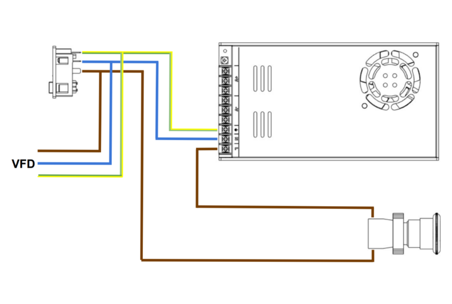{: .shadow}

### VFD / Spindle Wiring

There are a large number of VFD and spindle options available. This section of the manual provides general guidance only. Refer to your specific VFD manual for its setup. 

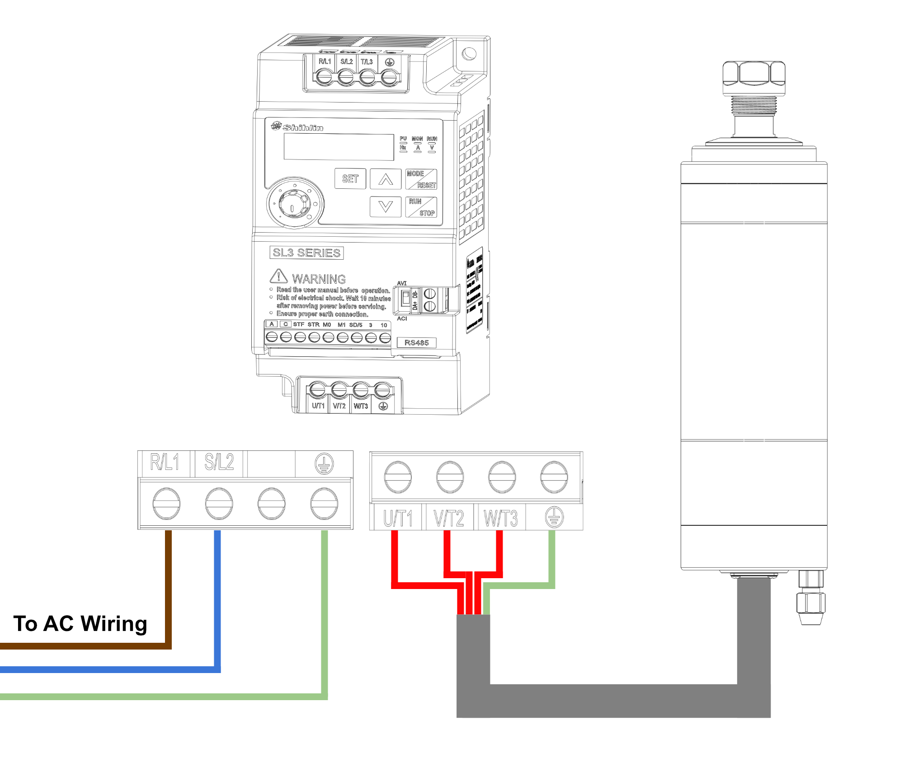{: .shadow}

!!!warning "VFD and Spindle Ground"
    You **MUST** make sure that your VFD and Spindle are properly grounded. Your VFD and Spindle are the only mains-powered items that you will come into contact with regularly during the operation of the machine, so these **MUST** have an operational ground connection **AT ALL TIMES**, and you **MUST** make sure that the socket you plug Milo into is properly grounded as well.

 Using a multimeter in continuity testing mode, you **MUST** be able to detect a connection between the ground pin on your AC inlet socket, the ground connector on your VFD, and the casing of your spindle.

 If your VFD is grounded but your spindle is not, you will need to [open the top casing of the spindle and connect the ground pin to the case of the spindle](https://wiki.printnc.info/en/electronics/vfd/config#grounding-shielding) - there are several spindles available where this connection is not made in the factory.

 You should **ALWAYS** check this before operating the machine for the first time.

---

## Mainboard Mounting

!!! info annotate "Components Required"
    ```
    4 x M3x10mm Self-tapping Screw
    2 x M5x10mm BHCS
    1 x Fly-CDYv3
    1 x Mainboard Mount (1)
    ```
1. :material-printer-3d-nozzle-heat-outline: Print this part using the [recommended settings](../../printing/print_guide.md#electronics-table)!

Screw the mainboard onto the mount using M3x10mm self-tapping screws.

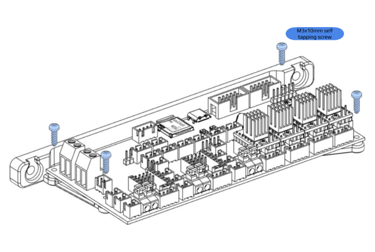{: .shadow}

!!! tip
    Make sure your SD card is installed before installing the board!

---

Mount the mainboard to the side extrusions of the electronics table using M5x10mm BHCS.

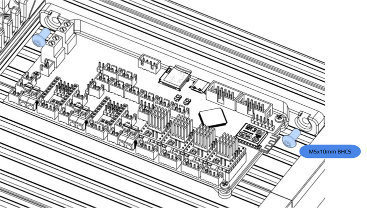{: .shadow}

---

## DC Wiring

!!! info annotate "Components Required"
    ```
    20AWG Silicone / PTFE Wiring (24v DC)
    24AWG Silicone / PTFE Wiring (Control wiring 3.3-5v DC)
    ```

Depending on how you want to control your spindle, you may need to add a few extra PCBs.

The example below is for a VFD-controlled spindle that accepts a 0-10V analog signal to control spindle speed.

You may also require a relay to send an enable signal to your VFD. If you wish to control your spindle manually then you can safely ignore these extra components.

{: .shadow}

!!! note
    There is no standard for motor wire colors - the motor wires shown in this example do not correlate with the rest of the legend.

!!! warning
    For safety reasons, it is always a good idea to wire your endstops in a normally closed configuration. This allows your machine to detect breaks in any of your cabling rather than manually detecting a failed endstop circuit when the table tries to move off the end of an axis!

!!! info annotate "VFD Wiring"
    There are a large number of VFD and spindle options available. This wiring diagram provides general guidance only. Refer to your specific VFD manual for its setup.

 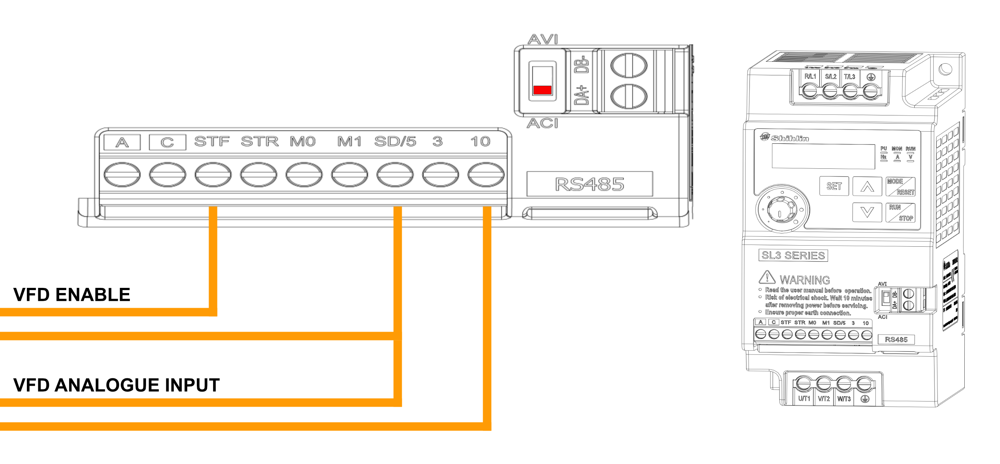

---

## Final Installation


!!! info annotate "Components Required"
    ```
    4 x M5x8mm BHCS
    1 x Electronics Enclosure Cover (1)
    ```
1. :material-laser-pointer: This cover can be laser cut from acrylic, or printed if you have a 3D printer large enough.


<!-- TODO: What fans are these? They aren't in the BOM -->
Screw the fans into the electronics enclosure cover using self-tapping fan screws.

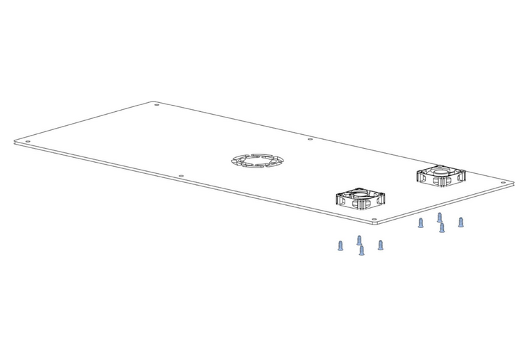{: .shadow}

---

Install the cover onto the electronics enclosure using M5x8mm BHCS, plugging the fans into the mainboard before screwing the cover down.

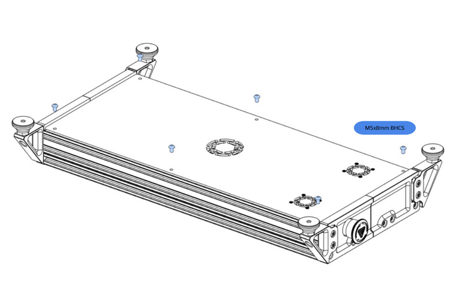{: .shadow}

---

Fix the table to the Y-Axis of the mill using 3 corner brackets placed equispaced along both sides.

{: .shadow}

{: .shadow}

---
!!! success ":fontawesome-solid-champagne-glasses: Congratulations!"
    Your mill is complete! You're ready to move onto the [Pre-Flight Checks!](./110_pre_flight_checks.md) to get started!
