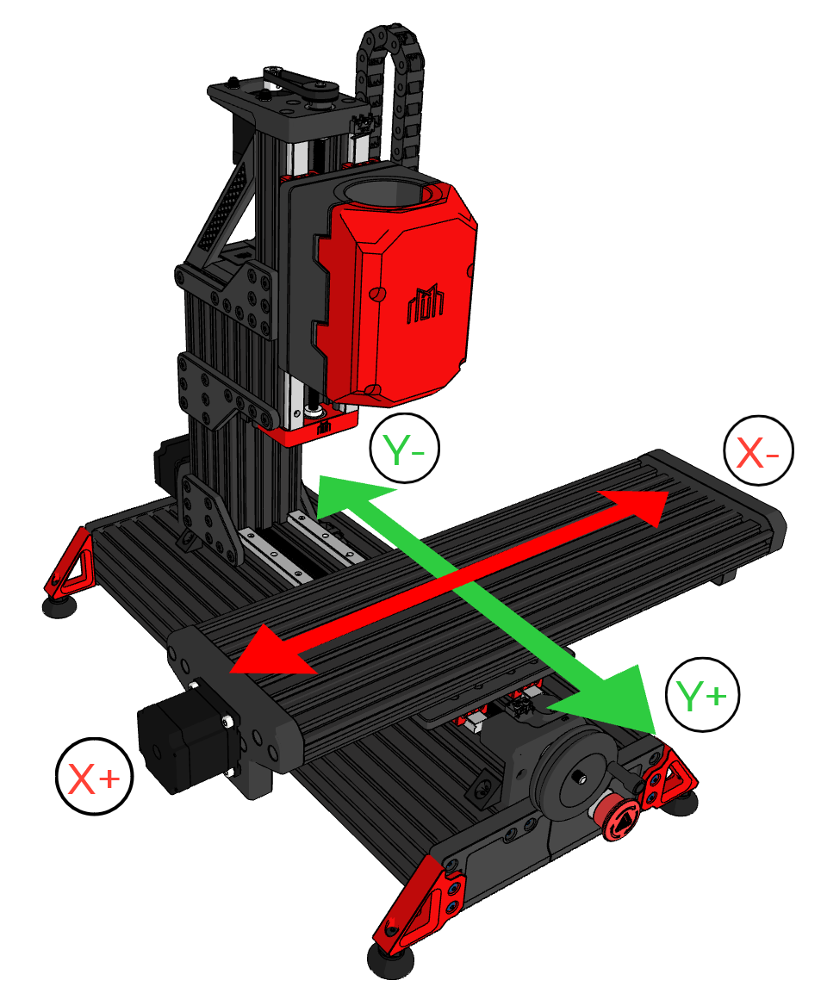

# Pre-Flight Checks

## Axis Directions
Axes movements are based on relative spindle movements and not the movement of the work table.

This may be confusing to new users, but to simplify the setup process we've created a diagram based on the
table movement instead. Use this as a reference to setup your axes direction in your `config.g` file.

For your Z axis the spindle should move up for Z+ and down for Z-.

{: .shadow}

---

## Endstop Query
Ensure that all your endstops are working correctly. To do this, press each endstop individually and enter
`M119` in the Duet web control console while holding the endstop closed. If it does not return as triggered,
then check your wiring and or your endstop setup in config.g.

---

## Homing Check
Ensure that all you homing routines in `homeall.g`, `homex.g`, `homey.g` and `homez.g` work appropriately. You should make sure your `Z` routine works first by running `G28 Z` from the console or clicking the 'Home Z' button in Duet Web Control. Once `Z` homes correctly, you can test `X` and `Y`, and then finally use the 'Home All' button or simply `G28` in the console.

---

## Steps-per-mm Calibration
You must ensure that when you move your axes X amount of millimeters it actually moves X amount of
millimeters.

<!-- TODO: Find relevant guide -->
If you do not know how to do this you can follow this [guide](https://google.co.uk).

---

## Check Backlash Compensation
Using an indicator, check all your axes for backlash by moving them back and forth and checking for variance.

If you are not happy with the amount of backlash then you can snug up the Anti-backlash nuts.

---

## Tram Work Surface
Make sure you tram your spindle appropriately to your work table.

If you are using a fixture of some kind, tram your spindle with reference to that instead.

---

## Spindle speed control
First, ensure your VFD is set up correctly according to its manual.

Then make sure to set your max spindle speed in `config.g`. Under the spindle section of your config find
the line beginning with `M950` and change the value found after `L` to your maximum spindle speed e.g. `L24000`.

---

## Grease everything!
If you have not done so yet make sure that all lead-screws and rails are appropriately greased and or oiled.

A good quality lithium grease (e.g. EP2) is recommended for this job.

---

!!! success ":fontawesome-solid-champagne-glasses: Congratulations!"
    With all of your pre-flight checks completed, you're ready to use your machine.
    Record a video of your first cut and submit it on our [Discord](https://discord.gg/ya4UUj7ax2) to receive your serial number!