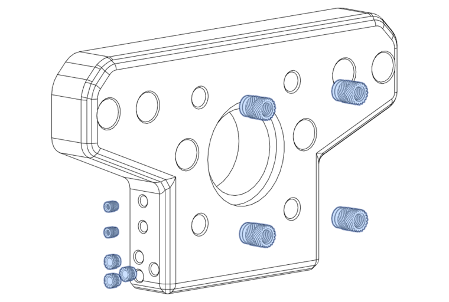
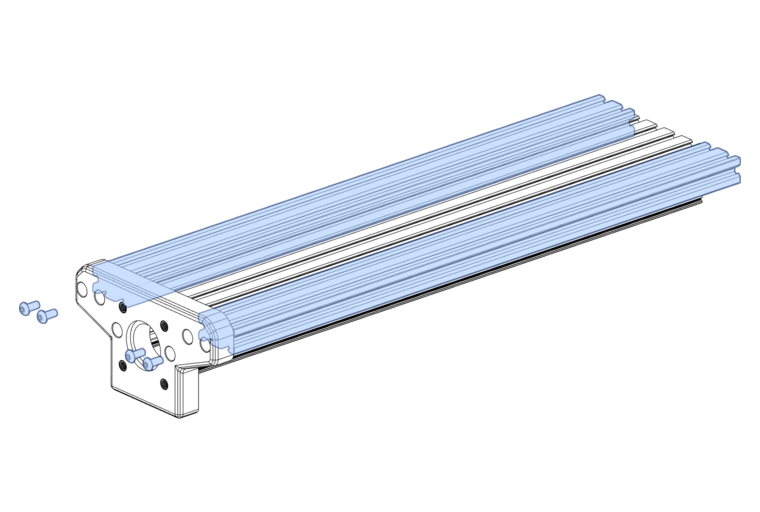
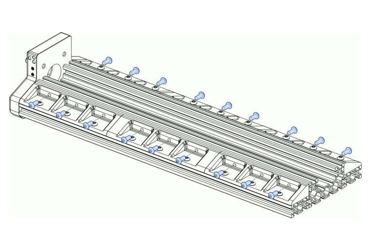
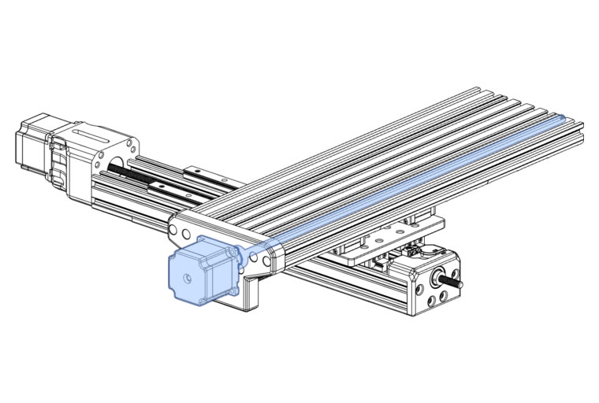
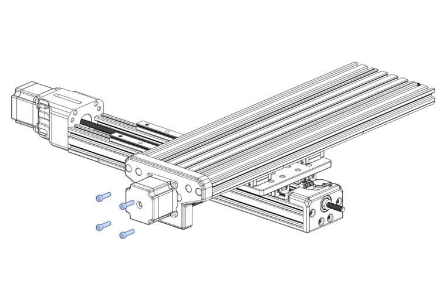
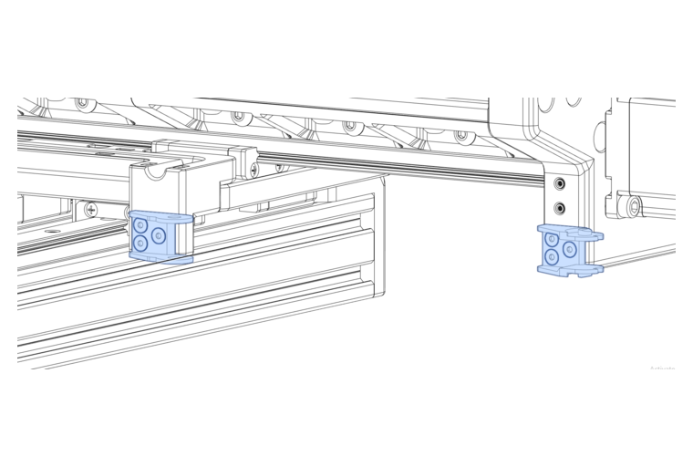
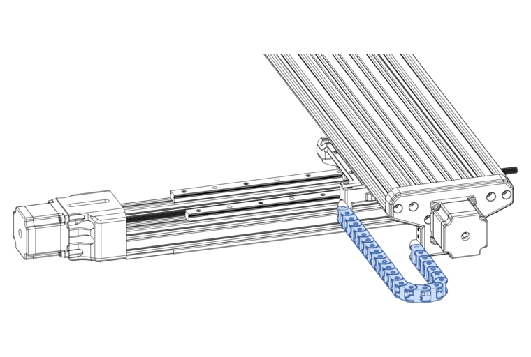
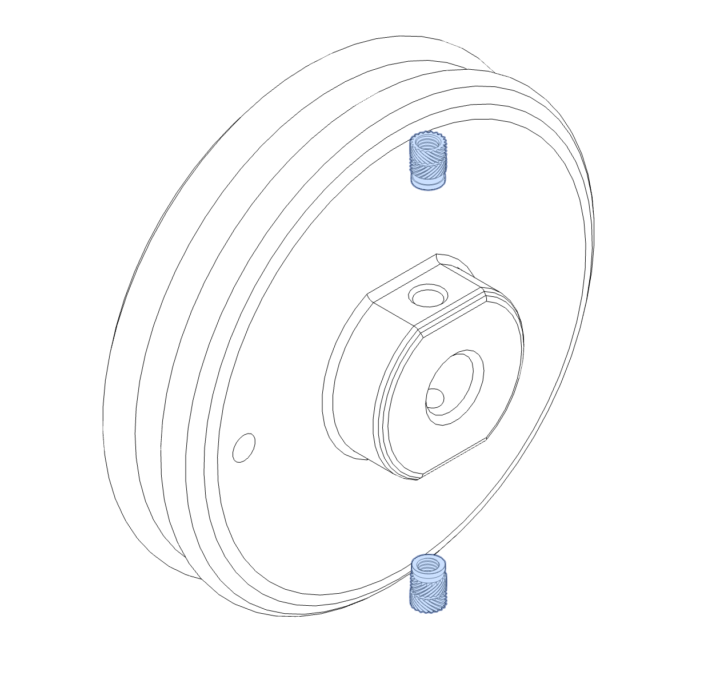
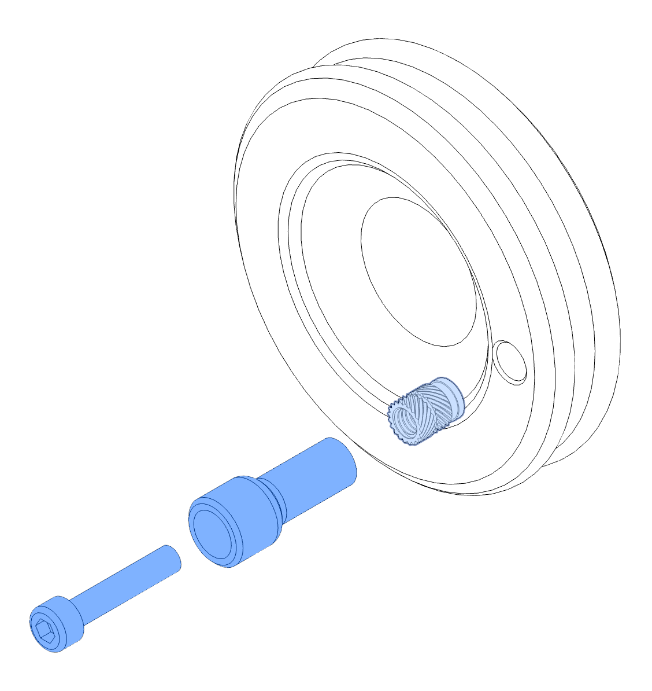

# X-Axis Assembly


---

## X-Axis Rails, Bearing Block, and Motor Mount

!!! info annotate "Components Required"
    ```
    12 x M3x10mm SHCS
     4 x M5 Heat-set Insert
     3 x M3 Heat-set Insert
     2 x M2.5 Heat-set Insert
     2 x MGN15 500mm Rails
     2 x F608ZZ bearing
     1 x 608ZZ bearing
     1 x Openbuilds 4080 C-Beam - 500mm
     1 x X-Axis Motor Mount (1)
     1 x X-Axis Bearing Block (2)
    ```

1. :material-printer-3d-nozzle-heat-outline: Print this part using the [recommended settings](../../printing/print_guide.md#x-axis-assembly)!
2. :material-printer-3d-nozzle-heat-outline: Print this part using the [recommended settings](../../printing/print_guide.md#x-axis-assembly)!

Fasten the MGN15 500mm rails to the extrusion by screwing M3x10mm SHCS into spring T-nuts inside the profile.

{: .shadow}

!!! tip annotate "Aligning the Rails"
    Repeat the alignment procedure described for the Y-Axis to ensure your rails are aligned with each other and the extrusion.

!!! tip annotate "Lubricating the Rails"
    If you didn't lubricate all of the rails when assembling the Y-Axis, ensure these rails are also lubricated as described in the Y-Axis section.

---

Insert a 608ZZ bearing in the hole in the outer face of the X-Axis Bearing Block, then an F608ZZ bearing on either side. The flanged bearings must sit flush inside the bearing block on both sides.

!!! tip
    The 'F' in F608ZZ stands for 'flanged'. The flange on the 2 outer bearings allows
    them to be pushed into place flush with the bearing block.

    The flange provides axial force against the bearing block when the locking collars
    are tightened up.

{: .shadow}

---

Insert the M2.5, M3, and M5 heat-set inserts into the X-Axis Motor Mount. M2.5 inserts are used for the endstop switch mount, M3 inserts for the drag-chain mount, and M5 inserts to mount the motor.

{: .shadow}

---

Fasten the X-Axis Motor Mount to the 500mm C-beam using M5x12mm BHCS.

{: .shadow}

---

## X-Axis Table

!!! info annotate "Components Required"
    ```
    22 x M5x12mm BHCS
    18 x M5x8mm BHCS
     4 x X-Axis Table Support (ends) (1)
     2 x X-Axis Table Support (centres) (2)
     2 x Openbuilds 2040 Extrusion - 500mm
    ```

1. :material-printer-3d-nozzle-heat-outline: Print this part using the [recommended settings](../../printing/print_guide.md#x-axis-assembly)!
2. :material-printer-3d-nozzle-heat-outline: Print this part using the [recommended settings](../../printing/print_guide.md#x-axis-assembly)!

Fasten the X-Axis Motor Mount to the 2040 extrusions using M5x12mm BHCS.

{: .shadow}

---

Fasten the X-Axis Table Supports to the C-Beam using M5x12mm BHCS and spring T-nuts.

{: .shadow}

---

Fasten the X-Axis Table Supports to the 2040 extrusions using M5x8mm BHCS and spring T-nuts.

{: .shadow}

!!! warning
    Double-check the length of the M5 bolts you're using. If your bolts are too long you will bottom out the bolt in the extrusion channel and it will not grip the table supports. If your bolts are too short you'll break the printed parts if you over-tighten them.

---

Slide the table into the carriages on the XY Gantry Plate from the left-hand side, with the machine facing the operator.

{: .shadow}

---

## X-Axis Motor and Lead-screw

!!! info annotate "Components Required"
    ```
    6 x M5x12mm BHCS
    4 x M5x20mm SHCS
    2 x Locking collar
    1 x NEMA23 Motor
    1 x 550mm Lead-screw
    1 x 8 to 6.35mm Rigid Coupler
    ```

Couple the NEMA23 motor to the lead screw using an 8 to 6.35mm rigid coupler.

Remember to use medium-strength threadlock on the grub screws in the couplers!

<!-- This image is reused from the y-axis assembly on purpose -->
{: .shadow}

!!! tip annotate "Lubricating the Leadscrews"
    If you didn't lubricate all of the leadscrews when assembling the Y-Axis, ensure this leadscrew are also lubricated as described in the Y-Axis section.

---

Insert the lead screw through the X-Axis Motor Mount, threading it through the X-Axis Bearing Block until it extends from the other end of the table.

{: .shadow}

---

Fasten the motor to the X-Axis Motor Mount using M5x20mm SHCS.

{: .shadow}

!!! tip
    Consider the cable exit orientation of the motor. We recommend having the cables exit downwards to help protect them.

!!! tip
    Now is a great time to adjust your anti-backlash nut as they are easily accessible before putting the X-Axis Bearing Block on.

---

Install a locking collar onto the lead screw, leaving it loose.

{: .shadow}

---

Fasten the X-Axis Bearing Block to the table assembly using M5x12mm BHCS. Loosely install a locking collar on the outside of the Bearing Block.

{: .shadow}

---

## Locking Collar Preload

Using your fingers, press each locking collar towards each other - driving them into the face of each bearing with moderate to high pressure. Tighten the inner collar first before tightening the external side collar. This will ensure that the screw remains in the same position during use.

!!! note
    Add some medium-strength threadlock to the grub screws.

{: .shadow}

---

## Drag Chain Ends

!!! info annotate "Components Required"
    ```
    6 x M3x6mm FHCS
    1 x Drag Chain Fixed End
    1 x Drag Chain Free End
    ```
Attach the drag chain ends to the XY Drag Chain Transition and X Motor Mount using M3x6mm FHCS.

!!! note "Drag chain orientation"
    Drag chains have 2 different sides - a fixed side and a free side. For this setup, the fixed side is connected to the XY Drag Chain Transition. The free side attaches itself to the X Motor Mount.

{: .shadow}

---

## Drag Chain Installation Point (Optional)

You may wish to install the rest of the drag chain to complete the X-Axis, however, it is often easier to thread your X-Axis motor and endstop cables through the loose chain before installing it - otherwise, it can become quite a tight space to work in later.

{: .shadow}

---

## X-Endstop

To avoid the endstop getting damaged during the rest of the assembly, it's a good idea not to install it at this point but rather install it later with the rest of the wiring.

{: .shadow}

---

## Handwheel (Optional)

!!! info annotate "Components Required (Per handwheel)"
    ```
    1 x M5x25mm SHCS
    2 x M3x10 SHCS
    1 x M5 Heat-set Insert
    2 x M3 Heat-set Insert
    1 x Handwheel (1)
    1 x Handwheel Handle (2)
    ```

1. :material-printer-3d-nozzle-heat-outline: Print this part using the [recommended settings](../../printing/print_guide.md#x-axis-assembly)!
2. :material-printer-3d-nozzle-heat-outline: Print this part using the [recommended settings](../../printing/print_guide.md#x-axis-assembly)!

Insert the M3 heat-set inserts into the handwheel. These inserts are used to hold the wheel onto the lead screw.

{: .shadow}

---

Insert the M5 heat-set insert into the handwheel. Attach the handwheel handle using an M5x25 SHCS bolt.

{: .shadow}

---

Place the handle onto the X and Y-Axis Lead-screws and secure using two M3x10 SHCS or two M3 grub screws.

{: .shadow}

!!! tip
    Repeat these handwheel steps for the Y-axis handwheel!

---

[Next Chapter: Z-Axis Assembly](./60_z_axis_assembly.md)
