# Z-Axis Assembly

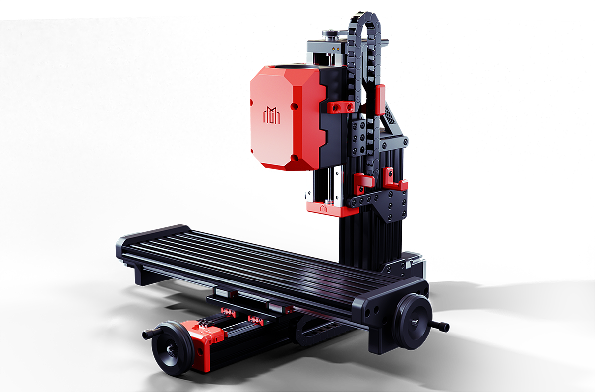

---

## Identifying Extrusions

This section of the build contains several C-beams that are close together. To help you identify which parts are which, lay out your extrusions like the diagram below. The next steps will then highlight which extrusions are used for each step.

!!! info "Components Required"
    ```
    A: Openbuilds 4080x260mm C-Beam
    B: Openbuilds 4080x260mm C-Beam
    C: Openbuilds 4080x250mm C-Beam
    D: Openbuilds 4080x120mm C-Beam
    ```

!!! tip
    The lengths shown are for a standard 60mm clearance build. A 120mm clearance build will have A & B be 60mm longer.

{: .shadow}

---

Extrusions `A` and `B` are the main Z-column extrusions.

{: .shadow}

---
## FMJ

*[FMJ]: Full Metal Jacket

!!! tip "Full Metal Jacket Installation"
    If you have Full Metal Jacket plates instead of the 3D printed column joining plates, please refer to the [FMJ Assembly](./70_fmj_assembly.md) guide. Once complete, you can return to the [Lower Bearing Block](#lower-bearing-block) section and continue your Z-Axis assembly.

---

## Installing the Column Plates

!!! info annotate "Components Required"
    ```
    20 x M5x12mm BHCS
     1 x Joining Plate B        (1)
     1 x Joining Plate C        (2)
     1 x Joining Plate B Mirror (3)
     1 x Joining Plate C Mirror (4)
    ```
1. :material-printer-3d-nozzle-heat-outline: Print this part using the [recommended settings](../../printing/print_guide.md#main-column)!
2. :material-printer-3d-nozzle-heat-outline: Print this part using the [recommended settings](../../printing/print_guide.md#main-column)!
3. :material-printer-3d-nozzle-heat-outline: Print this part using the [recommended settings](../../printing/print_guide.md#main-column)!
4. :material-printer-3d-nozzle-heat-outline: Print this part using the [recommended settings](../../printing/print_guide.md#main-column)!


Place extrusions `A` and `B` facing each other, creating an internal channel. This is where the ballast box can be installed (later, calm down cowboy!).

Install Joining Plate B and Joining Plate C on one side, using M5x12 BHCS to hold the extrusions together.

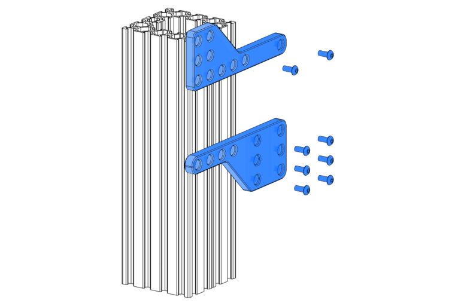{: .shadow}


---

!!! tip
    Ensure a `67mm` vertical spacing between the lower and upper column plates. The top of the thin part of the uppermost column plate should be flush with the top surface of the C-Beams.

{: .shadow}

---
Select extrusion `D`.

{: .shadow}

---

Place extrusion `D` at the top of the column with the channel facing _outwards_.

{: .shadow}

---

Use M5x12 BHCS to hold the extrusion in place against the column.

{: .shadow}

---

Select extrusion `C`.

{: .shadow}

---

Place it on the front of extrusion `D`, again with the channel facing _outwards_.

{: .shadow}

!!! tip
    The lower edge of extrusion `C` should be `18mm` above the lower edge of `D`, making room for the lower bearing block.

---

{: .shadow}

---
<!-- TODO do a composite image showing the zoom-in -->

Use M5x12 BHCS to hold the extrusion in place against the column.

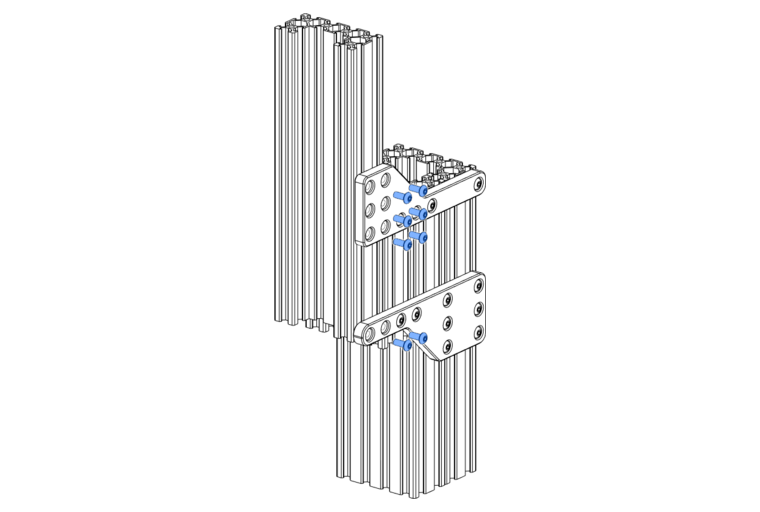{: .shadow}

At this point, you can install Joining Plate B Mirror and Joining Plate C Mirror on the other side of the column, taking care to align them with the plates on the other side.

---
## Lower Bearing Block

!!! info annotate "Components Required"
    ```
    4 x M5x12mm BHCS
    1 x 608ZZ bearing
    1 x Z-Axis Bearing Block (1)
    ```
1. :material-printer-3d-nozzle-heat-outline: Print this part using the [recommended settings](../../printing/print_guide.md#z-axis-assembly)!

Push the 608ZZ bearing into the bearing block until it is flush.

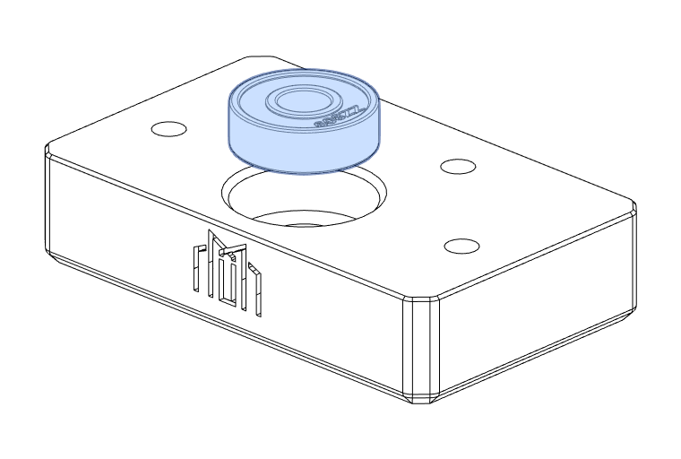{: .shadow}

---

Use M5x12mm BHCS to attach the bearing block to the bottom of extrusion `C`.

{: .shadow}

---

## Ballast Box

The ballast box is designed to house a damping load such as sand or epoxy granite. It is not a requirement but is recommended.

!!! info annotate "Components Required"
    ```
    1 x Ballast Box (1)
    1 x Ballast Cap (2)
    ```
1. :material-printer-3d-nozzle-heat-outline: Print this part using the [recommended settings](../../printing/print_guide.md#main-column)!
2. :material-printer-3d-nozzle-heat-outline: Print this part using the [recommended settings](../../printing/print_guide.md#main-column)!

{: .shadow}

!!! tip
    There is a small lip in the ballast box which registers with the tongue on the ballast cap.
    This is easiest to install at an angle.

!!! warning
    Once the ballast top is installed, it can be difficult to remove.
    Be sure that no other steps need to be taken before sealing the lid.

---

{: .shadow}

---

## Z-Axis Anti-Backlash Nut

!!! info annotate "Components Required"
    ```
    4 x M3 Heat-Set Insert
    4 x M3x8mm SHCS
    2 x M5 Heat-set Insert
    2 x Brass Lead-screw Nut
    1 x Locking Collar
    1 x Z-Axis Anti-Backlash Nut (1)
    ```
1. :material-printer-3d-nozzle-heat-outline: Print this part using the [recommended settings](../../printing/print_guide.md#z-axis-assembly)!

Insert the M3 and M5 heat-set inserts in the Z-Axis Anti-Backlash Nut.
<!-- This image is reused from the Y-Axis assembly on purpose -->
{: .shadow}

---

Fasten the Brass lead-screw nuts on either side of the Z-Axis Anti Backlash Nut using M3x8mm SHCS. Remember to apply medium-strength threadlock here, sparingly!

<!-- This image is reused from the Y-Axis assembly on purpose -->
{: .shadow}

---

Insert the lead screw into the anti-backlash nut and set the preload using the same technique as the X and Y nuts.

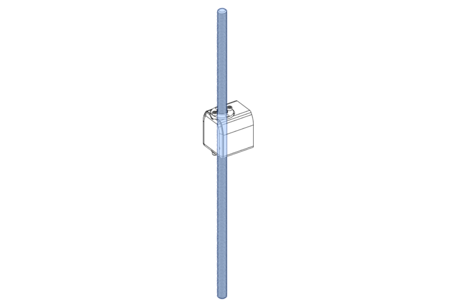{: .shadow}

---

Place a locking collar onto the bottom of the lead screw, and lock it in place. Remember to apply medium-strength threadlock to the grub screws!

{: .shadow}

!!! tip
    The locking collar should sit 13mm from the bottom of the lead screw.

---
<!-- TODO do a composite showing the zoom -->
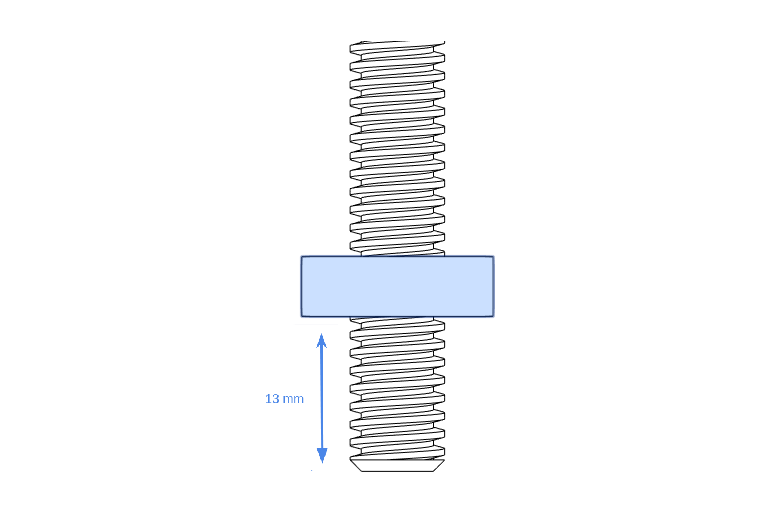{: .shadow}

---
## Z-Axis Rails and Lead-screw

!!! info annotate "Components Required"
    ```
    8 x M3x10mm SHCS
    2 x Brass Lead-screw Nut
    2 x MGN15 Rail 250mm
    1 x Z-Axis Lead-screw
    ```

!!! note
    If you followed the FMJ installation steps, your rails are already installed. Proceed to fit the lead screw!

Install the MGN15 250mm rails with only the lower carriages installed onto the `C` extrusion using M3x10mm SHCS. Make sure the end-most and centre-most bolt holes in each rail are used.

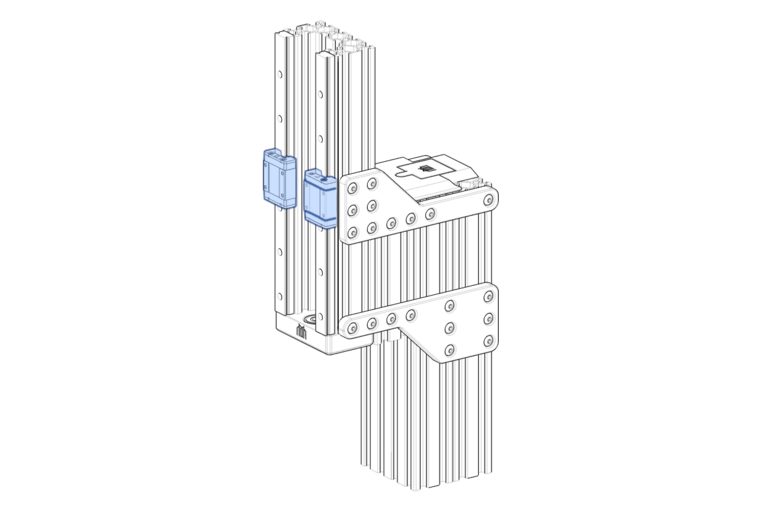{: .shadow}

!!! tip
    You can use the rail alignment guides to stop the lower carriages from falling off the vertical rail!

!!! tip annotate "Aligning the Rails"
    Repeat the alignment procedure described for the Y-Axis to ensure your rails are aligned with each other and the extrusion.

---

Place the lead screw with the locking collar at the bottom into the bearing at the bottom of the Z-axis. The curved surface of the anti-backlash nut should face upwards.

{: .shadow}

---

Install the upper rail carriages onto the Z rails, above the anti-backlash nut.

{: .shadow}

---

## Z-Axis Mounting Plate and Motor Mount

!!! info annotate "Components Required"
    ```
    16 x M3x5mm SHCS
     2 x M5x16mm BHCS
     2 x 608ZZ Bearing
     2 x M2.5 Heat-set Insert
     1 x GT2 40T Pulley
     1 x Locking Collar
     1 x Z-Axis Mounting Plate (1)
     1 x Z-Axis Motor Mount    (2)
    ```
1. For additional strength this part should be machined :material-saw-blade: but it can be printed :material-printer-3d-nozzle-heat-outline: using the [recommended settings](../../printing/print_guide.md#z-axis-assembly) if necessary.
2. :material-printer-3d-nozzle-heat-outline: Print this part using the [recommended settings](../../printing/print_guide.md#z-axis-assembly)!

Install the Z-Axis mounting plate onto the anti-backlash nut using M5x16mm BHCS.

{: .shadow}

---

Attach the Z-Axis mounting plate to the carriages using M3x5mm SHCS.

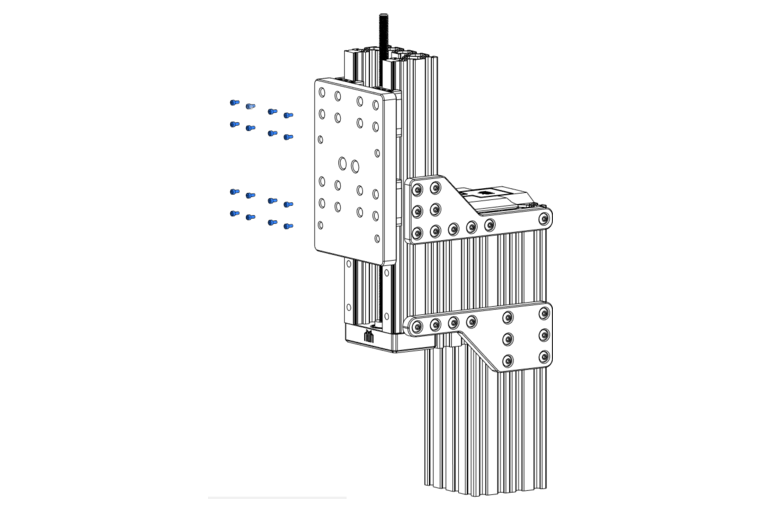{: .shadow}

---

Insert the 608ZZ bearings into the Z-Axis motor mount, and insert M2.5 heat-set inserts for the Z endstop.

{: .shadow}

---

Place a locking collar on the lead screw.

{: .shadow}

!!! tip
    Tighten the collar slightly so that it stays in place. If you drop it at this point, it will be a pain to fish it from behind the Z-axis mounting plate!

---

Install the Z-Axis motor mount onto the top of the C-beam using M5x12mm BHCS.

{: .shadow}

---

Fasten the GT2 40T Pulley onto the top of the lead screw.

With the Pulley attached above the bearings, you can now loosen off the locking collar below the bearings. Push it upwards until it contacts the lower bearing and lock it in place.

Remember to apply medium-strength threadlock to the grub screws!

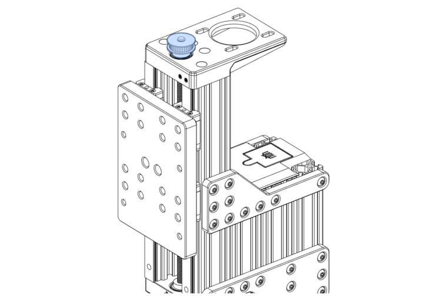{: .shadow}

---

## Z-Axis Motor

!!! info "Components Required"
    ```
    4 x M5x20mm SHCS
    4 x M5 Nyloc Nut
    4 x M5 Washer
    1 x NEMA23 Motor
    1 x GT2 20T Pulley
    1 x 200mm GT2 Belt
    ```

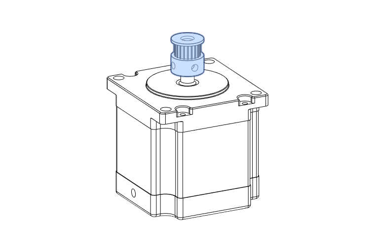{: .shadow}

---

When installing the Z motor, attach your belt loosely around your lead-screw pulley and then slide your Z motor in at an angle.

{: .shadow}

---

Attach the motor using M5x20mm SHCS with M5 washers and Nyloc nuts on the upper surface of the Z motor mounting plate.

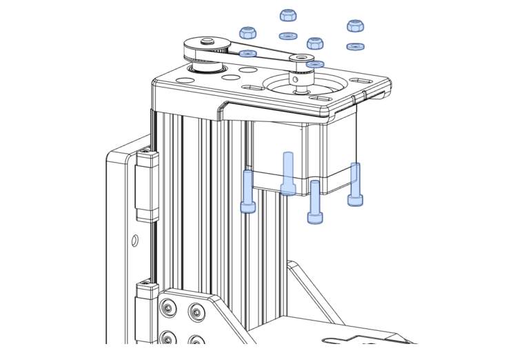{: .shadow}

!!! info
    Before tightening the fasteners fully, make sure the tension is set correctly.
    To do this, pull the motor away from the column with one hand until the belt can be strummed like a guitar string, and then tighten the fasteners in opposing corners first.

---
## Z-Axis Reinforcement Bracket

!!! info annotate "Components Required"
    ```
    4 x M5x12mm BHCS
    2 x Z Reinforcement Bracket (1)
    ```
1. :material-printer-3d-nozzle-heat-outline: Print this part using the [recommended settings](../../printing/print_guide.md)!

!!! note
    If you have FMJs on your Z-axis, these reinforcements are unnecessary.

Place the Z Reinforcement Brackets under the Z motor as shown below.

{: .shadow}

---

Attach the reinforcement brackets at the bottom using M5x12mm BHCS.

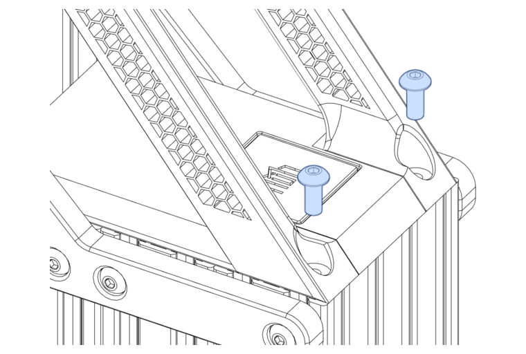{: .shadow}

---

And at the top using M5x12mm BHCS.

{: .shadow}

---
## Cable Management
!!! info annotate "Components Required"
    ```
    3 x M3 Heat-set Insert
    2 x M5x12mm BHCS
    1 x Z Drag-Chain Mount   (1)
    1 x Z Cable Redirect Hook (2)
    ```
1. :material-printer-3d-nozzle-heat-outline: Print this part using the [recommended settings](../../printing/print_guide.md#drag-chain-mounts)!
2. :material-printer-3d-nozzle-heat-outline: Print this part using the [recommended settings](../../printing/print_guide.md#drag-chain-mounts)!

Install the M3 heat-set inserts into the Z Drag-Chain Mount.

{: .shadow}

---

Install the Z Drag-Chain mount and Cable Redirect Hook using M5x12mm BHCS.

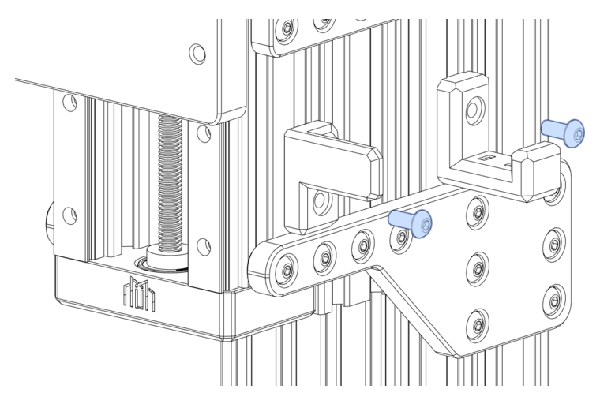{: .shadow}

---
## Joining Y- and Z-Axes (Standard)

!!! note
    If you have FMJ plates, skip to [Joining Y- and Z-Axes (FMJ)](#joining-y-and-z-axes-fmj)

!!! info annotate "Components Required"
    ```
    18 x M5x10mm BHCS
     1 x Assembled Y-Axis
     1 x Assembled Z-Axis
     1 x Joining Plate A        (1)
     1 x Joining Plate A Mirror (2)
    ```
1. :material-printer-3d-nozzle-heat-outline: Print this part using the [recommended settings](../../printing/print_guide.md#main-column)!
2. :material-printer-3d-nozzle-heat-outline: Print this part using the [recommended settings](../../printing/print_guide.md#main-column)!

Attach the assembled Y and Z-Axes using M5x10mm BHCS through the joining plates.

{: .shadow}

---

## Joining Y- and Z-Axes (FMJ)

!!! note
    If you do not have FMJ plates, follow [Joining Y- and Z-Axes (Standard)](#joining-y-and-z-axes-standard) above.

!!! info annotate "Components Required"
    ```
     10 x M5x12mm BHCS
     1 x Assembled Y-Axis
     1 x Assembled Z-Axis with FMJ
    ```

Attach the assembled Y and Z-Axes using M5x12mm BHCS through the bottom row of holes on each FMJ.

{: .shadow}

Attach the Y-Axis Motor Mount to the Z-Axis using M5x12mm BHCS.

{: .shadow}


---
## Spindle Mount

!!! info annotate "Components Required"
    ```
     4 x M5x100mm BHCS
     4 x M5 Washer
     2 x M5 Heat-set Insert
     1 x Spindle Mount Part A (1)
     1 x Spindle Mount Part B (2)
    ```
1. :material-printer-3d-nozzle-heat-outline: Print this part using the [recommended settings](../../printing/print_guide.md#spindle-mount)!
2. :material-printer-3d-nozzle-heat-outline: Print this part using the [recommended settings](../../printing/print_guide.md#spindle-mount)!

Install M5 Heat-set inserts into Spindle Mount Part B.

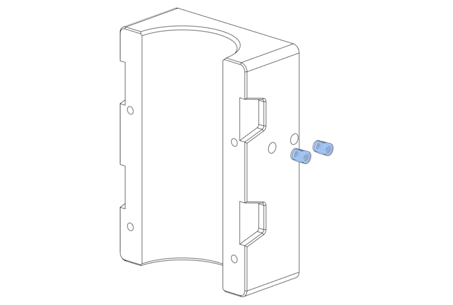{: .shadow}

---

Pass the M5x100mm BHCS through the M5 washers into Spindle Mount Part A and B.

{: .shadow}

---

## Install Spindle Mount

!!! info "Components Required"
    ```
     1 x Spindle Mount
     4 x M5 Nyloc Nuts
    ```

It has come time to install your spindle mount - but do not install your spindle at this point.

Bolt the M5x100mm BHCS through the Z-Axis Mounting Plate

{: .shadow}

---

Attach M5 Nyloc nuts on the backside.

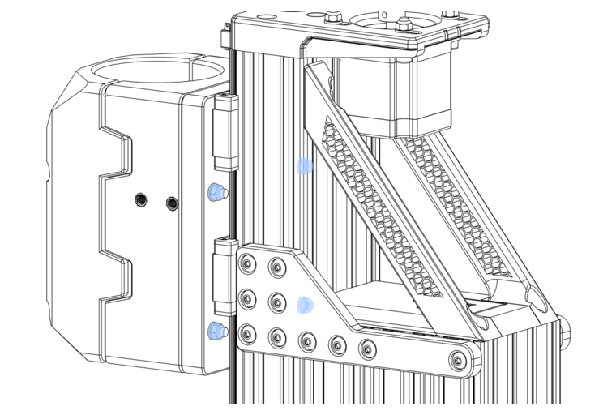{: .shadow}

!!! warning
    Do not tighten these nuts yet!

---

## Optional: Logo insert

!!! info annotate "Components Required"
    ```
     1 x Millennium Machines Logo (1)
     1 x Glue
    ```
1. :material-printer-3d-nozzle-heat-outline: Print this part using the [recommended settings](../../printing/print_guide.md#spindle-mount)!

If you wish, you can glue in your Millennium Machines Logo.

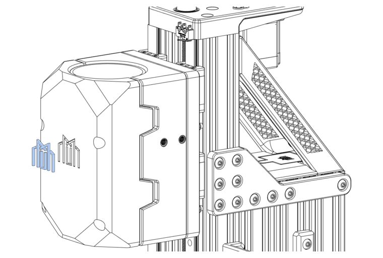{: .shadow}

---

## Cable Management... Continued
!!! info annotate "Components Required"
    ```
     6 x M3x6 FHCS
     3 x M3 Heat-set Insert
     2 x M5x12 BHCS
     1 x Z Drag-Chain Mount B (1)
     1 x Drag Chain
    ```
1. :material-printer-3d-nozzle-heat-outline: Print this part using the [recommended settings](../../printing/print_guide.md#drag-chain-mounts)!

Install the M3 Heat-set inserts into the Z Drag-Chain Mount B.

{: .shadow}

---

Attach Z Drag-Chain Mount B to the Spindle Mount using M5x12mm BHCS.

{: .shadow}

---

Use M3x6 FHCS to attach the Drag Chain floating and fixed ends to the drag chain mounts.

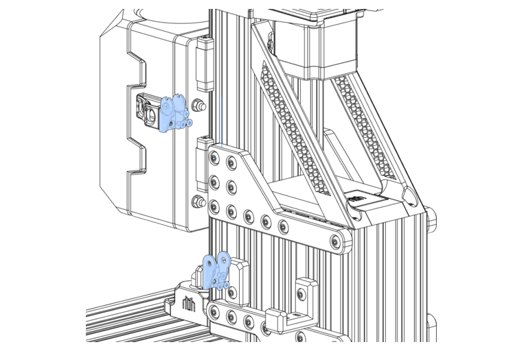{: .shadow}

---

Clip the drag chain body into place.

{: .shadow}

---

[Next Chapter: Table Assembly](./80_table_assembly.md)
